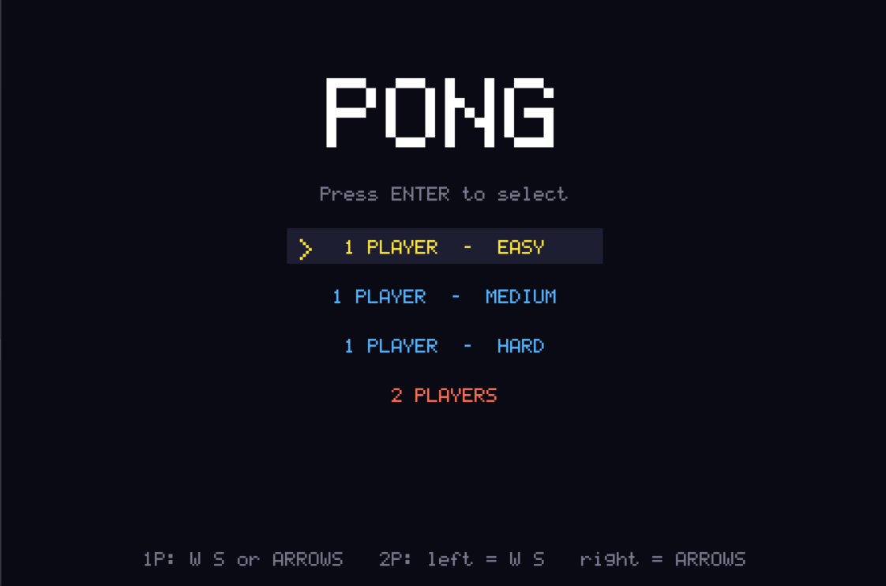
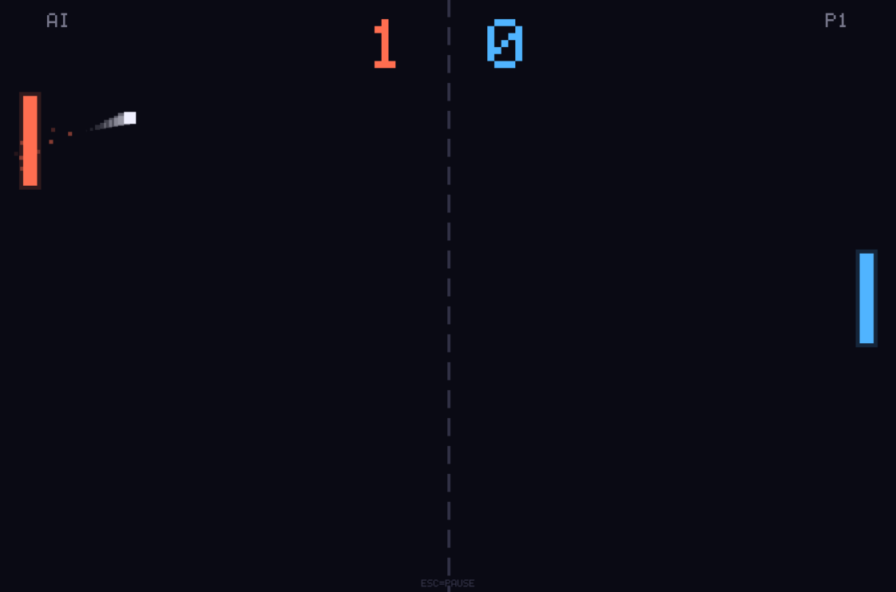

# 🏓 PONG — C++ / SDL2

A feature-rich Pong clone written in modern C++17, rendered with SDL2.
No external assets are required — fonts are drawn with a built-in 5×7 bitmap
renderer and audio is generated procedurally in real time.

---

## Game Preview





---

## Features

| Feature | Details |
|---|---|
| **Game modes** | 1-Player vs AI · Local 2-Player |
| **AI difficulty** | Easy · Medium · Hard (adaptive reaction speed & aiming error) |
| **Ball physics** | Speed increases every rally; spin based on where the ball hits the paddle |
| **Particle effects** | Burst particles on every paddle/wall hit |
| **Ball trail** | Ghost trail showing the last 8 positions |
| **Paddle glow** | Soft glow rendered around each paddle |
| **Procedural audio** | Sine-wave beeps generated live — no audio files needed |
| **Countdown** | 3-2-1 pause before each serve |
| **Win condition** | First player to **7 points** wins |
| **Screens** | Menu · Playing · Pause · Game Over |
| **Frame-rate independent** | Delta-time physics; targets 120 FPS with VSync |

---

## Controls

### Menu
| Key | Action |
|---|---|
| `W` / `↑` | Move selection up |
| `S` / `↓` | Move selection down |
| `Enter` / `Space` | Confirm |
| `Esc` | Quit |

### In-game
| Key | Player 1 (Right) | Player 2 / AI (Left) |
|---|---|---|
| Move up | `W` | `↑` |
| Move down | `S` | `↓` |

| Key | Action |
|---|---|
| `Esc` / `P` | Pause / Resume |
| `R` | Restart (from Pause or Game Over) |
| `M` | Back to Menu |

---

## Dependencies

Only **SDL2** is required (base library — no SDL2_mixer, no SDL2_ttf).

### Linux (Debian/Ubuntu)
```bash
sudo apt install libsdl2-dev build-essential
```

### macOS (Homebrew)
```bash
brew install sdl2
```

### Windows
Download the SDL2 development libraries (MinGW or MSVC) from
https://github.com/libsdl-org/SDL/releases and point your build system at them.

---

## Building

### Option A — Makefile (Linux / macOS, simplest)
```bash
make          # debug build  → ./pong
make release  # optimised    → ./pong
make run      # build + run
```

### Option B — CMake (cross-platform)
```bash
cmake -B build -DCMAKE_BUILD_TYPE=Release
cmake --build build
./build/pong
```

On Windows with MSVC:
```bat
cmake -B build
cmake --build build --config Release
build\Release\pong.exe
```

---

## Project layout

```
pong/
├── src/
│   └── main.cpp        ← entire game (single translation unit)
├── CMakeLists.txt      ← CMake build definition
├── Makefile            ← quick Makefile for Linux/macOS
└── README.md           ← this file
```

---

## How it works

### Ball spin
When the ball hits a paddle, its rebound angle is determined by where it
strikes relative to the paddle centre.  Hitting the top or bottom edges
deflects the ball at a steeper angle; hitting dead centre bounces it nearly
horizontally.  A minimum vertical component is enforced to avoid infinite
flat rallies.

### AI
The AI smoothly interpolates its paddle toward a *target* that tracks the
ball's Y position plus a small random *error* term.  The error magnitude and
interpolation speed are tuned per difficulty:

| Difficulty | Reaction rate | Max error |
|---|---|---|
| Easy | 1.5 Hz | ±80 px |
| Medium | 3 Hz | ±35 px |
| Hard | 6 Hz | ±10 px |

### Audio
SDL2's audio callback fills a mono float32 buffer with the sum of up to
four simultaneously active sine-wave beeps.  Each beep has its own frequency,
volume, and linear decay envelope.  No audio files are needed.